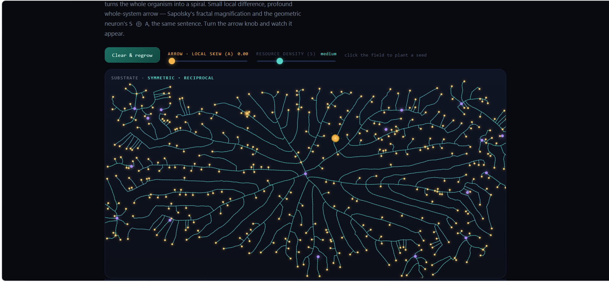

# A Fracture That Grows Its Own Arrow



### Sapolsky's fractal magnification and the geometric neuron's `S ⊕ A`, in one self-organizing thing you can watch grow.

**Live:** https://anttiluode.github.io/GeometricNeuronAndSapolskysFractal/
**PerceptionLab / Antti Luode, with Claude (Opus 4.8).**

> Do not hype. Do not lie. Just show.

---

## The idea

Robert Sapolsky's lectures on emergence make one move over and over: take a structure that looks like it needs a blueprint — an ant colony's optimal cemetery, a bronchial tree, a river delta, a dendritic arbor — and show there is no blueprint anywhere. The global shape falls out of a huge number of identical, cheap, local rules, each following the gradient right in front of it. No homunculus. His **fractal magnification**: a tiny local difference, repeated across scales, becomes a profound whole-system effect.

That is the same sentence as the geometric neuron's operator, `C_τ = S ⊕ A`:

- **`S`, the symmetric half** — the settling, space-filling, structure-building part. On its own it is *reciprocal*: it has no arrow. (This is the V13 wall from the ResonantNeuron line: you cannot draw a direction into passive geometry — the ratio comes back 1.0000.)
- **`A`, the skew half** — the antisymmetric twist that carries direction. The arrow has to be *generated* by an active local rule, not read off the geometry. (The V14 fix.)

This page fuses the two claims into a single living demonstration. A seed and a cloud of resource, and one cheap rule every growing tip obeys: **grow toward the nourishment nearby.** That symmetric rule alone fills space in a shapeless, handedness-free bush. Add a *whisper of skew* to each tip — a tiny local twist, the `A` — and magnified branch after branch, that one small asymmetry turns the whole organism into a spiral. Small local difference, profound global arrow. Fractal magnification and `S ⊕ A` are the same thing.

---

## What you're looking at

It grows on its own from a seed at the centre, eating the resource cloud. Then:

- **Clear & regrow** — start a fresh organism.
- **Arrow · local skew (A)** — the gold knob, the star of the page. At 0 the growth is reciprocal (a radial bush, no handedness). Turn it up and the whole tree spirals with one chirality.
- **Resource density (S)** — how much nourishment the symmetric field holds.
- **Click the field** — plant another seed and sprinkle fresh resource where you click.

Live readouts, all measured from the growth as it happens:

- **Complexity · nodes** — how much structure has emerged.
- **Spending · active tips** — where energy is being paid *right now*. Growth costs only where resource is unmet; colonized regions go dark and the cost falls to nothing (the dissipative settle, made visible).
- **Emergent arrow · chirality** — the net handedness of the whole tree.
- **Resource left** — how much of the field remains.

The algorithm underneath is **space colonization** (Runions et al.) — the real method behind leaf venation, coral, and dendritic arbors — with a per-tip chiral bias added. No tip knows the tree; each reads only its local gradient.

---

## The honest result

The headline claim — *a tiny local skew, magnified, becomes a global arrow* — was tested before it was shown. Chirality was measured over 12 independent regrows at each setting:

| local skew (A) | emergent chirality | spread |
|---|---|---|
| **0.00** | 0.015 | ± 0.056 |
| **0.20** | 0.081 | ± 0.012 |
| **0.30** | 0.124 | ± 0.013 |

Two things are true here, and both matter:

- At **skew 0**, the handedness only *wanders near zero*. Whatever chirality a single tree shows is **chance** — a fresh regrow washes it away. Structure without an arrow. The V13 result.
- Turn the skew up and the chirality doesn't just rise, it **sharpens**: the spread collapses from ±0.056 to ±0.012. A weak local rule leaves the whole shape at the mercy of noise; a strong one compounds into a coherent, repeatable arrow. **Small systematic local bias beats large random noise, once it's magnified.** The V14 fix — and the reason a fern, a galaxy's arm, and a dendritic tree all curl the same way down their whole length.

The first version of this page measured chirality on a lazy running average that turned out to track noise, not skew. The test caught it; the metric was rebuilt (the plain mean pitch of each segment) until the numbers were real. That's the whole ethic.

---

## What it is, and what it isn't

**Is:** a genuinely self-organizing fractal — real space-colonization growth with a real per-tip chiral bias. Every number on screen is computed live from the growth: node count, active tips, and the net chirality measured from the segments as they form.

**Isn't:** a claim that the tree feels its growing. "Resource" and "surprise" are the model's words for *gradient* and *unmet demand*, not measured biology. This locates a mechanism — how a cheap local rule with a skew produces a global arrow — not an experience.

---

## Run it

It's a single self-contained `index.html`. No build, no dependencies.

```
# just open it
open index.html
# or serve it
python -m http.server
```

Or use the live page: https://anttiluode.github.io/GeometricNeuronAndSapolskysFractal/

Works on desktop and mobile; respects `prefers-reduced-motion`.

---

## Lineage

Part of the PerceptionLab geometric-neuron line (github.com/anttiluode):

- `C_τ = S ⊕ A`, *the arrow is the skew half* — **GeometricNeuron** (V9).
- *direction must be generated by an active element, not passive geometry* (V13 → V14) — **ResonantNeuron**.
- *reversing the arrow costs entropy; the cost is substrate-dependent* — **AgainstTheGrain**.
- *chiral defects as topological memory* (the whorl the spiral echoes) — **ArtificialCortex**.
- Robert Sapolsky, *Emergence and Complexity* (Stanford, Human Behavioral Biology) — the fractal-magnification framing this page grows out of.

The framing — that Sapolsky's emergence and the geometric neuron's skew operator are the same claim, and that a fractal can grow its own arrow — and the direction are Antti Luode's; the page, the metric, and this README were built with Claude (Opus 4.8). MIT.

*A seed, a cloud, and one small twist. Turn the arrow up and watch a bush become a spiral — the shape of a fern, a galaxy, a dendrite — drawn out of nothing but a local rule, magnified. Do not hype. Do not lie. Just show.*
